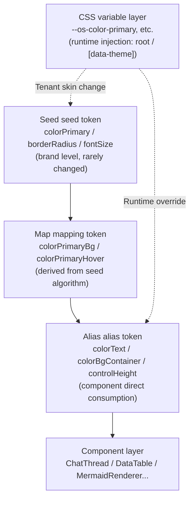
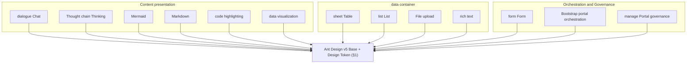
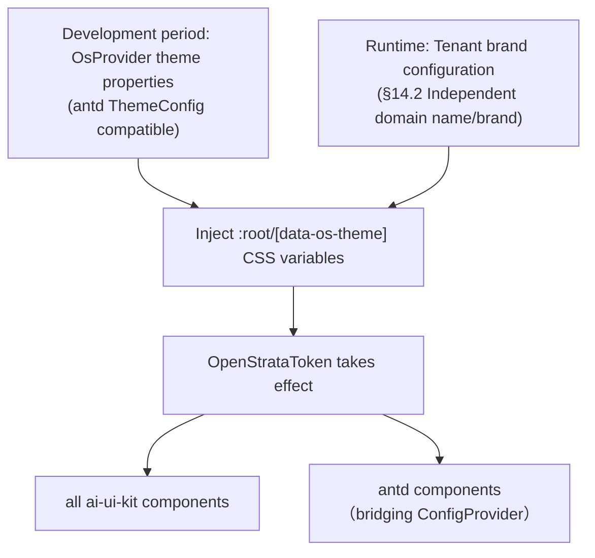
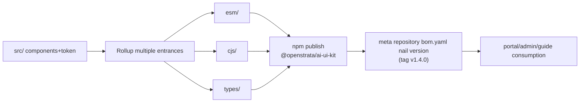
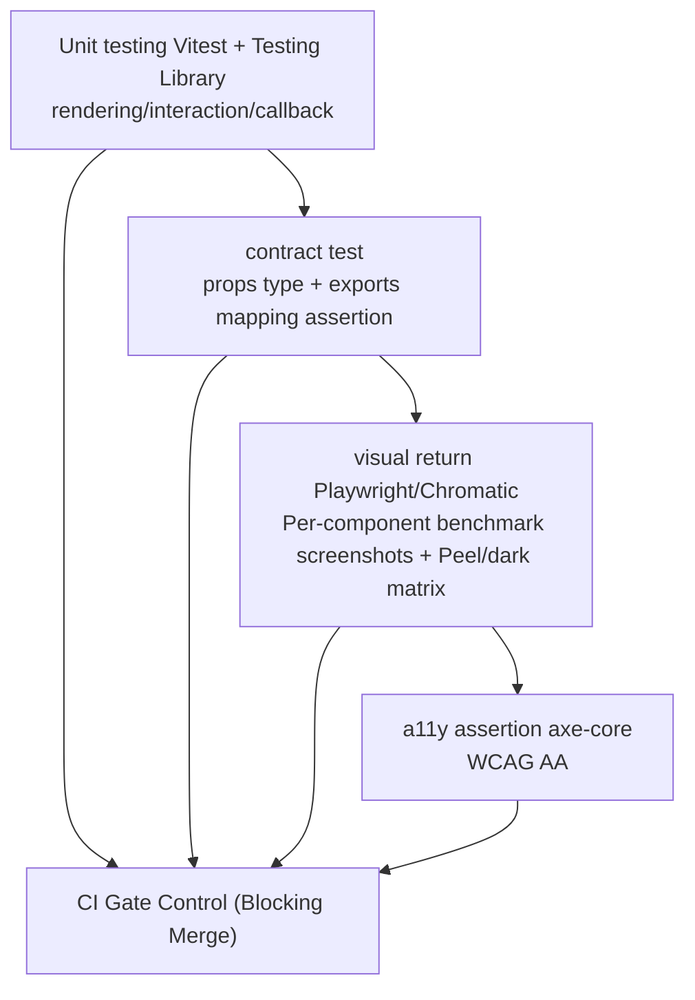

# ai-ui-kit · Detailed design document (DESIGN)

> This document is the **detailed design document** of `ai-ui-kit` (OpenStrata out-of-the-box AI UI component library), which is one of the sources of truth for "Evolutionary AI Coding" in the `design/` directory. Major design decisions are settled in `design/adr/` with **ADR** (breaking changes must bump `MAJOR` with an ADR attached, echoing §16.1).

## Meta information

| item | value |
| --- | --- |
| **repo** | `ai-ui-kit`（`github.com/openstrata/ai-ui-kit`） |
| **Language · Framework** | TypeScript · React 18 + Vite + Ant Design(antd) v5 + Storybook 8 + Rollup |
| **domain** | frontend |
| **optional** | false (core, required) |
| **Platform version** | v1.4.0 (consistent with `openstrata-meta/repos.yaml` · `bom.yaml` pinned version) |
| **Document Status** | Draft (Draft) |
| **Responsible Person** | OpenStrata Architecture Group |
| **Affiliated links** | This repository [`arch/ARCH.md`](../arch/ARCH.md) · [`skills/SKILLS.md`](../skills/SKILLS.md) · [`specs/SPECS.md`](../specs/SPECS.md) ; Architectural Design Document v2.8 → §4.1.2 (AI UI Component Library), §5.1 (Technology Selection Matrix L9), §13 (Guide Portal), §14 (Overall Management Portal), §15.2/§15.6 (Framework and Directory), §16 (Release and BOM) |

---

## 1. Positioning and design tokens (Design tokens / theme system)

### 1.1 Positioning (§4.1.2 · §5.1)

`ai-ui-kit` is the "out-of-box AI interactive component library" of OpenStrata's **L9 front-end access layer**. The goal is to allow the enterprise's internal business front-end to obtain a consistent AI UX with **zero duplication of development**. It does not directly access the model - the component consumes the data stream provided by the upstream (gateway/Agent runtime/business front end) in the form of **props/callback**, and is only responsible for **rendering and interaction**.

- **Boundary**: It only solves the problem of "how to present and interact with AI content in a beautiful and useful way"; it does not carry business logic, does not directly connect to LLM, and does not send network requests (data is injected through props, and side effects are called back through events).
- **Optional**: Marked as core (required), co-dependent by `ai-portal-frontend`, `ai-admin-frontend`, `ai-guide-portal` (see each profile: starter / standard / advanced / full all contain `ai-ui-kit`).
- **Technical Convergence**: Following the principle of §15.2 "Use React + antd for all front-ends", this library uses **Ant Design v5 as the base UI** and encapsulates the AI specialized OSS capabilities specified in §4.1.2 of the architecture document (assistant-ui chat primitive, mermaid.js, TanStack Table, react-markdown, Tiptap, react-dropzone, Recharts/ECharts, shiki).

> **Naming alignment with architecture document examples**: §4.1.2 The code example uses the package name `@ai-infra/ui-kit`; the official npm package name of this repository is **`@openstrata/ai-ui-kit`** (consistent with the repo identification). For compatibility with older examples in `specs/SPECS.md` and bootstrap documentation, `@ai-infra/ui-kit` can be retained as an alias specification (see §10 Open Question OQ-1).

### 1.2 Design Tokens

The theme system is based on the **Ant Design v5 Design Token** three-layer model (Seed → Map → Alias), and overlays a layer of **CSS variables (custom attributes)** to support **runtime per-tenant skinning** (echoing §14.2 "Optional independent access to domain names/brands").



Token contract (TypeScript type, as the Theme interface exposed by the library):

```typescript
//Design token type (compatible with antd v5 ThemeConfig and extending OpenStrata brand tokens)
export interface OpenStrataToken {
  /** Brand main color（seed），default OpenStrata blue */
  colorPrimary: string;
  /** Fillet base（seed） */
  borderRadius: number;
  /** Font size base（seed） */
  fontSize: number;
  /** Whether dark mode */
  dark?: boolean;
  /** Component level density：compact | default | comfortable */
  density?: 'compact' | 'default' | 'comfortable';
  /** brand token（only ai-ui-kit Component consumption，Does not pollute antd overall situation） */
  brand: {
    /** Streaming cursor / Thought chain highlight color */
    streaming: string;
    /** "AI generated"Mark background color */
    aiBadge: string;
    /** Tool call card stroke */
    toolCallBorder: string;
  };
}

/** Used for skinning at runtime CSS variable name prefix */
export const CSS_VAR_PREFIX = '--os' as const; //--os-color-primary etc.
```

Design tokens are issued uniformly by `<OsProvider theme={...}>` (internal bridge antd `ConfigProvider` + inject `:root` CSS variable), singleton, and can be nested and overridden.

---

## 2. Component list and classification (Table / List / Mermaid / Form / Dialogue...)

The component list **complete coverage** of the 10 categories of AI UI patterns listed in §4.1.2 of the architecture document, and supplements the orchestration/governance components required by §13 (Guide Portal), §14 (Management Portal). The classification is as follows:

| # | Classification | Components | Underlying Implementation (§4.1.2 / §5.1) | Architecture Document Mapping |
| --- | --- | --- | --- | --- |
| A | **Chat** | `ChatThread` / `MessageList` / `MessageBubble` / `MessageComposer` / `StreamingText` / `ToolCallCard` | assistant-ui Chat Primitive + Vercel AI SDK Streaming | §4.1.2 (Chat Conversation/Streaming Rendering); §13.4 (MVP Chat UI); §5.1 (AI UI Component) |
| B | **Thinking Chain Thinking** | `ThinkingProcess` (folded reasoning steps) | Self-developed (§4.1.2 clarifies "self-developed components") | §4.1.2 (Thinking chain display) |
| C | **Table** | `DataTable` (sort/filter/paging/virtual scrolling) | TanStack Table + antd | §4.1.2 (table/list); §14 Management Portal table view |
| D | **List List** | `DataList` / `VirtualList` / `EmptyState` | antd List + Virtual Scroll | §4.1.2 (Table/List); §14 Resource/User List |
| E | **Mermaid diagram** | `MermaidRenderer` (automatically recognizes ` ```mermaid ` code blocks) | mermaid.js | §4.1.2 (Mermaid diagram); §13/§14 Architecture diagram rendering |
| F | **Markdown** | `MarkdownRenderer` (GFM + code highlighting + inline Mermaid/Table) | react-markdown + rehype + shiki | §4.1.2 (Markdown rendering/code highlighting) |
| G | **Code Highlighting** | `CodeBlock` (200+ languages) | shiki/prism | §4.1.2 (Code Highlighting) |
| H | **Data Visualization** | `ChartCard` (line/column/pie, can embed LLM reply) | Recharts / ECharts | §4.1.2 (data visualization) |
| I | **Rich text editing** | `PromptEditor` (prompt editing/document annotation) | Tiptap | §4.1.2 (rich text editing) |
| J | **File upload** | `FileDropzone` (document upload preview) | react-dropzone | §4.1.2 (file upload) |
| K | **Form** | `AIForm` / `FormField` (Schema driver) | antd Form (extension) | §13.1 (Capability Card/Form); §14.3 User Form |
| L | **Guide Portal Orchestrationment** | `CapabilityCard` (capability check card) / `ChangePreview` (new/reused/offline preview) / `StatusBoard` (deployment health board) | Self-developed (based on antd + the above basic components) | §13.1 (Capability Card/Change Preview/Status Board) |
| M | **Management Portal Governance** | `ResourceUsage` (Allocation/Usage/Quota View) / `TenantCard` / `UserTable` / `QuotaEditor` | Self-developed (based on C/D/K) | §14.2–§14.5 (Tenant/User/Resource Management) |

> **Coverage conclusion**: The 10 categories of modes in §4.1.2 of the architecture document (chat dialogue, streaming rendering, Markdown, Mermaid, table/list, code highlighting, data visualization, rich text, file upload, thought chain) have been **all covered**; the required components of §13 "Capability Card/Change Preview/Status Board" of the guidance portal and §14 "Tenant/User/Resource Governance" of the management portal have also been completed (category L, M).

Overview of component classification:



---

## 3. Component API specification (Props/Slots/Events contract)

All components follow the same convention:

- **Data Downstream**: Pure props injection, component **no side effects network calls**; streaming content driven by controlled `messages` / `content` + `streaming` flags.
- **Event upstream**: `on*` callback (events); user actions such as tool invocation, submission, skin change, etc. are exposed to the host as events.
- **Slots**: React implements slot overrides through `components` / `renderXxx` / `children` (echoing the §4.1.2 `ChatThread.components` example).
- **Version Contract**: The component props type is with the library version SemVer (§7), and the destructive change bump `MAJOR` is accompanied by ADR.

### 3.1 Dialogue class (ChatThread)

```typescript
export interface ChatMessage {
  id: string;
  role: 'user' | 'assistant' | 'system' | 'tool';
  content: string;            //Markdown / with mermaid/table code block
  streaming?: boolean;        //Is the output still streaming?
  toolCalls?: ToolCall[];     //Tool call (for display)
  createdAt: number;
}

export interface ToolCall {
  id: string;
  name: string;
  args: unknown;
  status: 'pending' | 'running' | 'done' | 'error';
  result?: unknown;
}

export interface ChatThreadProps {
  messages: ChatMessage[];                 //Controlled message list
  streaming?: boolean;                     //Global streaming switch (default true)
  loading?: boolean;                       //Waiting for first token
  /** slot：Override renderer（echo §4.1.2 Example） */
  components?: {
    mermaid?: React.ComponentType<{ code: string }>;
    table?: React.ComponentType<{ data: unknown[] }>;
    thinking?: React.ComponentType<{ steps: ThinkingStep[] }>;
    markdown?: React.ComponentType<{ content: string }>;
  };
  /** User submits messages */
  onSend?: (text: string) => void;
  /** Visualization of tool calling process（Return to custom card） */
  onToolCall?: (tool: ToolCall) => React.ReactNode;
  /** Stop current streaming build */
  onStop?: () => void;
  /** Regenerate the previous item */
  onRegenerate?: (messageId: string) => void;
  className?: string;
}
```

### 3.2 Table class (DataTable)

```typescript
export interface DataTableColumn<T> {
  key: keyof T & string;
  title: string;
  sortable?: boolean;
  filterable?: boolean;
  render?: (value: T[keyof T], row: T) => React.ReactNode;
  width?: number;
}

export interface DataTableProps<T> {
  data: T[];
  columns: DataTableColumn<T>[];
  rowKey: keyof T & string;
  virtualized?: boolean;          //Virtual scrolling (large data volumes)
  pagination?: false | { pageSize: number };
  density?: 'compact' | 'default' | 'comfortable';
  onRowClick?: (row: T) => void;
  empty?: React.ReactNode;        //Slot: empty
  loading?: boolean;
}
```

### 3.3 Mermaid / Markdown renderer

```typescript
export interface MermaidRendererProps {
  code: string;                   //mermaid source code
  theme?: 'default' | 'dark';     //Following OsProvider, it can be covered
  onError?: (err: Error) => void;
}

export interface MarkdownRendererProps {
  content: string;                //Support GFM
  /** Whether to automatically ```mermaid block handed over MermaidRenderer */
  renderMermaid?: boolean;        //Default true
  /** Whether to automatically hand over the form block to DataTable */
  renderTable?: boolean;          //Default true
  codeHighlight?: 'shiki' | 'prism'; //Default shiki
  components?: Record<string, React.ComponentType<any>>; //Custom node
}
```

### 3.4 Guide portal orchestration class (CapabilityCard/ChangePreview)

```typescript
export interface CapabilityCardProps {
  id: string;                    //capability key (such as rag / multitenancy)
  title: string;                 //business language title
  description: string;
  checked: boolean;              //controlled tick
  dependsOn?: string[];          //Automatically expanded forward dependencies (§13.2)
  recommended?: boolean;
  onChange?: (id: string, checked: boolean) => void;
}

export interface ChangePreviewProps {
  /** Dependency graph engine output（§13.3） */
  plan: {
    added: string[];             //Components will be added
    reused: string[];            //Reuse components
    removed: string[];           //Components will be taken offline
  };
  onConfirm?: () => void;
  onCancel?: () => void;
}
```

> The props contracts of other components (ThinkingProcess / ChartCard / PromptEditor / FileDropzone / ResourceUsage, etc.) are consolidated as TypeScript types in `specs/SPECS.md` and are verified with the library release (echoing "source of fact that can be verified by AI and consumers").

---

## 4. Architecture and directory structure (exports/tree-shaking)

### 4.1 Layering and dependency direction (§15.5 · §15.6.2)

As a pure front-end component library, the four layers of DDD are weakened into "**Base layer → Orchestration layer → Entry layer**"; no back-end port-adapter is introduced (no network/no Agent runtime dependency), but the "**anti-corrosion layer**" idea is retained: all external OSS (mermaid / TanStack / Tiptap, etc.) are adapted through thin packaging, and future replacement can achieve **zero changes** to upper-layer components.

```mermaid
flowchart LR
    subgraph entrance level[entrance level / exports]
      IDX["index.ts<br/>+ independent entrance for each component"]
    end
    subgraph orchestration layer[orchestration layer / components]
      CHAT[dialogue/Thought chain]
      DATA[sheet/list]
      REND[Markdown/Mermaid/chart]
      ORCH[bootstrap portal/manage Portal Orchestration]
    end
    subgraph base level[base level / primitives + theme]
      THEME[OsProvider + design token §1]
      ADPT[OSS adapter<br/>mermaid/TanStack/Tiptap...]
      ANTD[antd v5 base]
    end
    IDX --> orchestration layer
    orchestration layer --> base level
    ADPT -. "Anti-corrosion layer isolation" .-> EXT[external OSS]
```

### 4.2 Directory structure

```
ai-ui-kit/
├── src/
│   ├── index.ts                 #bucket file (re-export, sideEffects: false)
│   ├── theme/                   #§1 Design Token + OsProvider
│   │   ├── tokens.ts            #OpenStrataToken type and default value
│   │   ├── OsProvider.tsx       #Bridging antd ConfigProvider + CSS variables
│   │   └── css-vars.ts          #CSS variable injection/reading
│   ├── primitives/              #Thinly packaged external OSS adapter (anti-corrosion layer)
│   │   ├── mermaid/  tanstack/  tiptap/  dropzone/  recharts/
│   ├── components/              #Business components (classified by §2 A–M)
│   │   ├── chat/  thinking/  table/  list/  mermaid/  markdown/
│   │   ├── chart/  editor/  upload/  form/  guide/  admin/
│   │   └── <Component>/index.tsx + <Component>.types.ts
│   └── utils/                   #Streaming parsing, markdown chunking, a11y assistant
├── stories/                     #§8 Storybook Story
├── tests/                       #§9 Unit + Vision + a11y
├── package.json  rollup.config.mjs  tsconfig.json  .storybook/
├── arch/  design/  skills/  specs/   #Meta information four-piece set (immovable)
└── infrastructure/config/       #This repository SPI adapter local configuration fragment (§15.6.2)
```

### 4.3 Tree-shaking and export strategy

- **Multiple entries (per-component entry)**: The `exports` field of `package.json` provides independent sub-paths for each component, such as `@openstrata/ai-ui-kit/chat` / `/table` / `/mermaid`, supporting introduction on demand.
- **`sideEffects: false`**: Tags have no side effects except for `theme`/CSS entry, making it easier for the packager to shake the tree.
- **Dual format products** (Rollup): `esm/` (modern packager), `cjs/` (compatible), `types/` (`.d.ts`), `module` points to ESM.
- **peerDependencies**: `react` / `react-dom` / `antd` as peers (not packaged into products to avoid duplicate antd instances and theme conflicts).

```jsonc
//package.json (excerpt)
{
  "name": "@openstrata/ai-ui-kit",
  "version": "1.4.0",
  "type": "module",
  "sideEffects": ["*.css", "./theme/index.css"],
  "exports": {
    ".": { "types": "./types/index.d.ts", "import": "./esm/index.js" },
    "./chat": { "types": "./types/components/chat.d.ts", "import": "./esm/chat.js" },
    "./table": { "types": "./types/components/table.d.ts", "import": "./esm/table.js" },
    "./mermaid": { "types": "./types/components/mermaid.d.ts", "import": "./esm/mermaid.js" },
    "./theme": { "types": "./types/theme/index.d.ts", "import": "./esm/theme.js" }
  },
  "peerDependencies": { "react": ">=18", "react-dom": ">=18", "antd": ">=5" }
}
```

---

## 5. Theming and customization (Theming/overlay)

The theme system meets two types of customization needs: **Brand customization during development** and **Tenant reskinning during operation**.



- **Development period customization**: `<OsProvider theme={{ colorPrimary: '#xxx', dark: true, density: 'compact' }}>`. Fully compatible with antd `ThemeConfig`, can overlay dodge/algorithm (`theme.darkAlgorithm`).
- **Tenant reskinning during runtime**: Management Portal (§14.2) distributes brand colors according to tenants, and the library writes them into `document.documentElement.style.setProperty('--os-color-primary', ...)` without re-rendering the entire tree; supports **multi-tenant same page isolation** (through `data-os-theme="tenant-a"` scope).
- **Partial Overrides**: Single components accept `theme` / `className` / `style`, and support the `components` slot replacement renderer (§3.1).
- **Dark Mode**: `dark` flag toggles antd algorithm + in-library CSS variable mapping.
- **Downgrade Compatibility**: Fall back to the built-in default token when `OsProvider` is not wrapped, ensuring that the component can be used independently.

---

## 6. Accessibility and Internationalization (a11y/i18n)

### 6.1 Accessibility (a11y)

- **Semantic roles**: `role="log"` + `aria-live="polite"` (streaming incremental broadcast) is used in the dialogue area; `aria-expanded` is used for thought chain folding; the table supports `role="grid"` / column header `aria-sort`.
- **Keyboard Reachable**: Message input `Ctrl/Cmd+Enter` to send; conversation list `↑/↓` history switching; all interactive elements can be tab focusable, visible focus ring (from design token `colorPrimary`).
- **Contrast**: The default color matching of the token meets WCAG 2.1 AA (text contrast ≥ 4.5:1).
- **Motion downgrade**: respect `prefers-reduced-motion`, streaming cursor/typewriter animation can be turned off.
- **Test**: Each component comes with axe-core automated a11y assertions (§9).

### 6.2 Internationalization (i18n)

- **Copywriting**: Built-in Chinese/English dictionary, based on `react-i18next` or antd `ConfigProvider.locale`; component internal copywriting (such as "Generating...", "Stop", "Regenerate") uses i18n key, and hard coding is prohibited.
- **RTL**: Layout tokenization, supports `direction: rtl` scope.
- **Number/Date**: Formatted by `Intl` (quota, token usage, etc., echoing §14 resource view).
- **Collaboration with the host**: The host delivers languages ​​uniformly through `<OsProvider locale="en">`, and the component does not detect the browser language on its own (to avoid conflicts with the business front-end).

---

## 7. Build/release/version strategy (npm/semver)

### 7.1 Build (§15.6.2 · §15.6.4)

- **Builder**: Rollup (multiple entries, dual formats, `.d.ts` is closed by `tsc --emitDeclarationOnly` + `api-extractor`).
- **CI**: Each repository has an independent `.github` (build/test/scan/publish), decoupled from consumers such as `ai-portal-frontend`.
- **Product Verification**: `peerDependencies` and `exports` mapping are used to make consistency assertions in CI (to avoid missing exports of sub-paths).

### 7.2 Versions and Releases (§16.1 · §16.2)

- **Library Version**: Follow `MAJOR.MINOR.PATCH` (SemVer). **Baseline Alignment Platform v1.4.0**, the first version is released as `1.4.0`, and will be incrementally increased independently at its own pace (echoing §15.6.4 "Independent semantic versions for each App repository").
- **Relationship with platform BOM**: The library version is nailed by `openstrata-meta/bom.yaml` / `repos.yaml` (currently `tag: v1.4.0`); upgrading the library version must be synchronized with the original repository, and the CI verification must be consistent (§15.6.4 Cross-repository modification rules).
- **Destructive changes**: Destructive changes to the props contract must **bump `MAJOR`** and record an ADR in `design/adr/` (inherit the original DESIGN.md rules).
- **Interface version statement**: Refer to §16.1 "Each capability interface is independent of SemVer". The library declares the **minimum compatible interface version** (such as `UiKit: 1.0.0`) in the `openstrata.interfaceVersion` field of `package.json` for dependency verification by the boot portal/management portal.
- **Release product**: npm tarball + entry for this component in `strata-bom` (name/version/license/status=`core`/`enabled_by_default=true`/`languages=[javascript]`/`verified`/`spi` is left blank - this library is a non-SPI capable instance).



### 7.3 License

- Library ontology **MIT** (consistent with §5.1 AI UI component MIT); the external OSSs it depends on are all OSI compatible (assistant-ui MIT, mermaid MIT, TanStack MIT, react-markdown MIT, Tiptap MIT, Recharts MIT, react-dropzone MIT, shiki MIT), and meet §16.2/§16.3 `core` must be OSI constraints.

---

## 8. Documentation and Demonstration (Storybook)

- **Storybook 8**: Each component under `stories/` has at least one story (Default / Variant / Boundary State). Dialogue, form, and Mermaid provide **interactive stories** (`play` function simulates streaming, page turning, and skin changing).
- **Type-driven documentation**: Automatically generate Props table (SB `argTypes` / `autodocs`) from `.types.ts` to ensure that the document is consistent with the type (echoing `specs/` verifiable fact source).
- **Scenario Story (Guides)**:
- *MVP Chat Agent* (§13.4): `ChatThread` + streaming + tool call card splicing.
- *Boot Portal Assembly* (§13.1): `CapabilityCard` + `ChangePreview` + `StatusBoard`.
- *Manage Portal Governance* (§14): `TenantCard` + `ResourceUsage` + `QuotaEditor`.
- *Markdown Rich Rendering*: `MarkdownRenderer` automatically inlines Mermaid/Table/CodeBlock (§4.1.2 example).
- **Local preview**: `npm run storybook` (default `:6006`); when publishing, `storybook build` will produce a static station and be linked to the platform document station.
- **Linkage with skills**: The `add-component` skill in `skills/SKILLS.md` automatically generates component skeleton + matching Story + type contract, ensuring that "newly added components must have stories and types".

---

## 9. Testing Strategy (Visual/Unit)

The four layers of "**unit + visual + contract + a11y**" are adopted, echoing §15.6.2 test strategy and §16.2 `verified` certification.



- **Unit testing (Vitest + @testing-library/react)**: Each component covers rendering, props variants, event callbacks (such as `onSend` / `onToolCall` / `onChange`), empty state/loading state.
- **Contract test**: parse `*.types.ts` and runtime props, assert destructive changes; verify `package.json` `exports` corresponds to the product one-to-one (to prevent tree-shaking and broken links).
- **Visual regression (Playwright + Chromatic or Percy)**: Screenshot comparison of each component under multiple themes (light/dark), multiple densities, and key viewports; threshold exceedance blocks release. Mermaid/Markdown rendering results incorporate visual baselines.
- **a11y test**: Each story runs `axe-core` and can be merged with zero violations.
- **Coverage Threshold**: Component logic line coverage ≥ 85%, `chat` / `table` / `mermaid` core path 100%.
- **SPI/anti-corrosion layer test**: The OSS adapter verifies in the mock environment that "replacing the underlying implementation does not affect the upper-layer components" (echoing §15.5 principle of zero modification to the anti-corrosion layer).

---

## 10. Open questions

| Number | Question | Notes/Relations § |
| --- | --- | --- |
| **OQ-1** | Should the official npm package name be `@openstrata/ai-ui-kit` or the architecture documentation example `@ai-infra/ui-kit`? Do you want to keep the alias? | §4.1.2 The example uses `@ai-infra/ui-kit`; the repo is identified as `ai-ui-kit`. It is recommended to refer to `@openstrata/ai-ui-kit` and mark the alias in `specs/SPECS.md`. |
| **OQ-2** | For the base UI, should I choose **antd** or **shadcn/ui** from the §4.1.2 table? Will the coexistence of the two result in conflict between the two sets of design tokens? | §15.5 The framework converges to antd; §4.1.2 Selection column shadcn. This design uses antd as the base and shadcn as a reference only. The architecture team needs to confirm the convergence conclusion. |
| **OQ-3** | How deep is the coupling of streaming rendering based on **Vercel AI SDK**? Abstract to a framework-agnostic `ChatMessage` stream interface to avoid locking React Server Components? | §4.1.2 Column Vercel AI SDK (Apache-2.0). It is recommended to only consume its type and not bind the runtime. |
| **OQ-4** | Mermaid's rendering and hydration strategy under SSR (Next.js, §2.2 front-end using Next.js)? Is client-side rendering and lazy loading the default? | Boot Portal/Management Portal is CSR (Vite), but requires compatibility with potential SSR hosts. |
| **OQ-5** | Is the library version strictly released simultaneously with the platform v1.4.0, or is it independent of SemVer? How does the `openstrata.interfaceVersion` namespace align with §16.1's class 15 SPI ports (this library is not an SPI instance)? | §16.1 Each capability interface is independent SemVer; this library needs to define its own interface version number. |
| **OQ-6** | CSS variable scope isolation for runtime tenant skinning. How to avoid token pollution in micro-frontend (multiple React instances) scenario? | §14.2 Tenant brand/independent domain name; `shadow DOM` or `data-os-theme` scope scheme needs to be specified. |
| **OQ-7** | Stability strategy for visual regression baselines under cross-OS/cross-browser font differences (Chromatic vs self-hosted)? | §9 Visual regression. |
| **OQ-8** | Will React 19 compatibility and antd v6 upgrade route be included in the v1.4.x plan? | Current baseline React 18 + antd v5 (§15.5). |

---

## Change record

| Version | Date | Author | Description |
| --- | --- | --- | --- |
| 1.0.0-draft | 2026-07-17 | OpenStrata Architecture Group | First draft: Detailed design of the AI ​​UI component library covering §4.1.2 / §5.1 / §13 / §14 of the architecture document (10 sections + meta information + traceability matrix). Overwrite and replace the original `design/DESIGN.md` placeholder skeleton. |

## Traceability Matrix (Chapter of this document ↔ Architecture Design Document v2.8 §)

| This document | Architectural design document correspondence § | Content mapping |
| --- | --- | --- |
| §1 Positioning and Design Token | §4.1.2, §5.1 (L9 AI UI), §14.2 (Tenant Brand), §15.2/§15.5 (Framework), §15.6.2 | Component library positioning, Design Token three layers + CSS variable skinning |
| §2 Component List | §4.1.2 (10 categories of AI UI patterns), §5.1 (Technology Selection), §13.1 (Guide Portal Orchestration), §14.2–§14.5 (Management Portal Governance) | 13 categories of components cover all architectural requirements |
| §3 API specification | §4.1.2 (ChatThread example), §15.5 (layering/contract), §16.1 (interface version) | Props/Slots/Events contract + TS interface |
| §4 Architecture and Directory | §15.5 (DDD/anti-corrosion layer), §15.6.2 (repository structure), §15.6.4 (polyrepo/independent version) | Layering, directory, tree-shaking, multiple entries |
| §5 Theme and customizability | §14.2 (independent domain name/brand), §4.1.2 (component selection) | Skin change, dark color, partial coverage during development/runtime |
| §6 Accessibility and Internationalization | §14.3 (Users/Roles/SSO), Universal a11y Principles | ARIA/Keyboard/i18n/RTL |
| §7 Build release version | §16.1 (SemVer/release), §16.2 (BOM field), §15.6.4 (cross-repository version pinning/CI consistency) | Rollup dual format, npm, ADR, BOM pinning version |
| §8 Documentation and Demonstration | §15.6.2 (skills/specs source of truth), §4.1.2, §13.4, §14 | Storybook 8 Component + Scenario Story |
| §9 Testing Strategy | §15.6.2 (Testing), §16.2 (verified certification) | Unit/Contract/Visual/a11y Four Layers |
| §10 Open Issues | §4.1.2, §13, §14, §16.1, §15.5 | 8 Pending Group Decisions |
