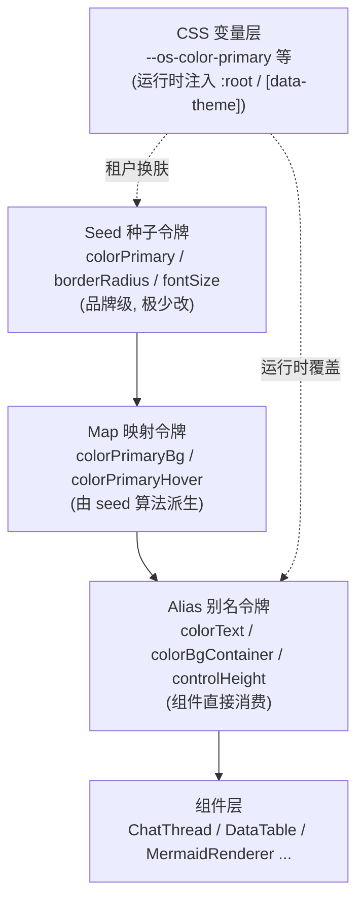
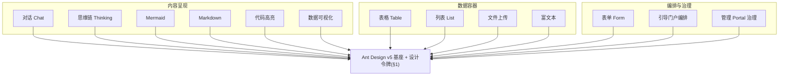
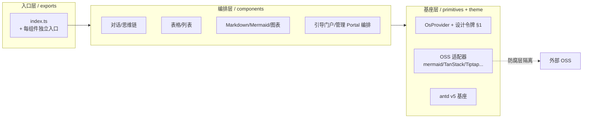
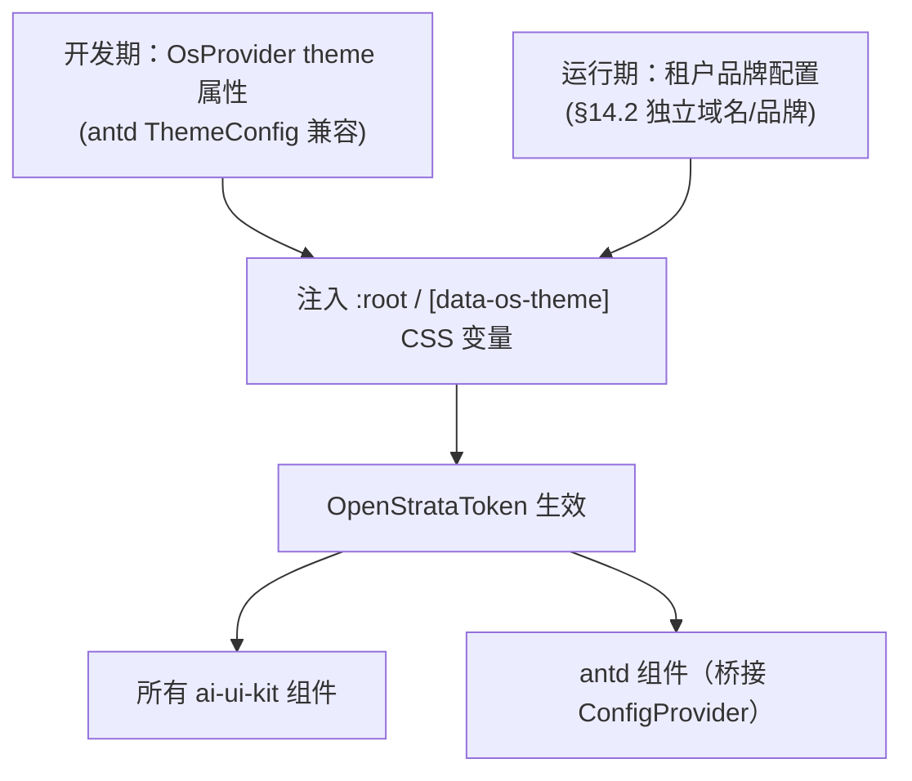
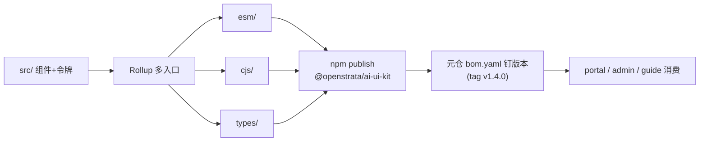
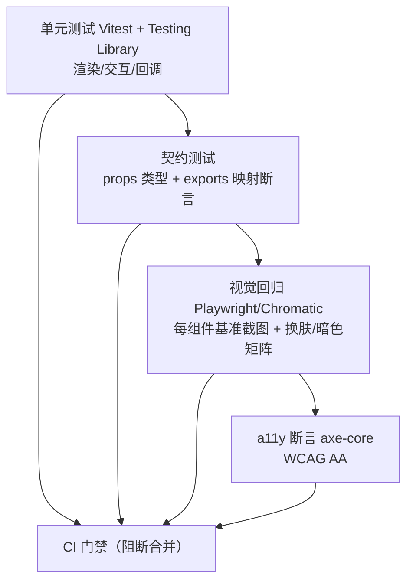

# ai-ui-kit · 详细设计文档（DESIGN）

> 本文档为 `ai-ui-kit`（OpenStrata 开箱即用 AI UI 组件库）的**详细设计文档**，是 `design/` 目录下"演化式 AI 编码"事实源之一。重大设计决策以 **ADR** 沉淀于 `design/adr/`（破坏性变更须 bump `MAJOR` 并附 ADR，呼应 §16.1）。

## 元信息

| 项 | 值 |
| --- | --- |
| **repo** | `ai-ui-kit`（`github.com/openstrata/ai-ui-kit`） |
| **语言 · 框架** | TypeScript · React 18 + Vite + Ant Design(antd) v5 + Storybook 8 + Rollup |
| **领域（domain）** | frontend |
| **optional** | false（core，必选） |
| **平台版本** | v1.4.0（与 `openstrata-meta/repos.yaml` · `bom.yaml` 钉版本一致） |
| **文档状态** | 草稿（Draft） |
| **负责人** | OpenStrata 架构组 |
| **关联链接** | 本仓 [`arch/ARCH.md`](../arch/ARCH.md) · [`skills/SKILLS.md`](../skills/SKILLS.md) · [`specs/SPECS.md`](../specs/SPECS.md) ；架构设计文档 v2.8 → §4.1.2（AI UI 组件库）、§5.1（技术选型矩阵 L9）、§13（引导门户）、§14（整体管理 Portal）、§15.2/§15.7（框架与目录）、§16（发版与 BOM） |

---

## 1. 定位与设计令牌（Design tokens / 主题系统）

### 1.1 定位（§4.1.2 · §5.1）

`ai-ui-kit` 是 OpenStrata **L9 前端接入层**的"开箱即用 AI 交互组件库"，目标是让企业内部业务前端**零重复开发**地获得一致的 AI UX。它不直接接入模型——组件以 **props / 回调** 的方式消费上游（网关 / Agent 运行时 / 业务前端）提供的数据流，仅负责**渲染与交互**。

- **边界**：只解决"AI 内容如何好看、好用地呈现与交互"这一件事；不承载业务逻辑、不直连 LLM、不发网络请求（数据通过 props 注入，副作用通过 events 回调）。
- **可选性**：标记为 core（必选），被 `ai-portal-frontend`、`ai-admin-frontend`、`ai-guide-portal` 共同依赖（见各 profile：starter / standard / advanced / full 均包含 `ai-ui-kit`）。
- **技术收敛**：遵循 §15.2"所有前端用 React + antd"原则，本库以 **Ant Design v5 为基座 UI**，并在其上封装架构文档 §4.1.2 指定的 AI 专精 OSS 能力（assistant-ui 聊天基元、mermaid.js、TanStack Table、react-markdown、Tiptap、react-dropzone、Recharts/ECharts、shiki）。

> **与架构文档示例的命名对齐**：§4.1.2 代码示例使用包名 `@ai-infra/ui-kit`；本仓正式 npm 包名定为 **`@openstrata/ai-ui-kit`**（与 repo 标识一致）。在 `specs/SPECS.md` 与引导门户文档中如需兼容旧示例，可保留 `@ai-infra/ui-kit` 作为别名说明（见 §10 开放问题 OQ-1）。

### 1.2 设计令牌体系（Design Tokens）

主题系统基于 **Ant Design v5 Design Token** 三层模型（Seed → Map → Alias），并叠加一层 **CSS 变量（自定义属性）** 以支持**运行时按租户换肤**（呼应 §14.2"可选独立访问域名/品牌"）。



令牌契约（TypeScript 类型，作为库对外暴露的 Theme 接口）：

```typescript
// 设计令牌类型（与 antd v5 ThemeConfig 兼容并扩展 OpenStrata 品牌令牌）
export interface OpenStrataToken {
  /** 品牌主色（seed），默认 OpenStrata 蓝 */
  colorPrimary: string;
  /** 圆角基数（seed） */
  borderRadius: number;
  /** 字号基数（seed） */
  fontSize: number;
  /** 是否暗色模式 */
  dark?: boolean;
  /** 组件级密度：compact | default | comfortable */
  density?: 'compact' | 'default' | 'comfortable';
  /** 品牌令牌（仅 ai-ui-kit 组件消费，不污染 antd 全局） */
  brand: {
    /** 流式光标 / 思考链高亮色 */
    streaming: string;
    /** "AI 生成"角标底色 */
    aiBadge: string;
    /** 工具调用卡片描边 */
    toolCallBorder: string;
  };
}

/** 运行时换肤用的 CSS 变量名前缀 */
export const CSS_VAR_PREFIX = '--os' as const; // --os-color-primary 等
```

设计令牌由 `<OsProvider theme={...}>` 统一下发（内部桥接 antd `ConfigProvider` + 注入 `:root` CSS 变量），单例、可嵌套覆盖。

---

## 2. 组件清单与分类（表格 / 列表 / Mermaid / 表单 / 对话…）

组件清单**完整覆盖**架构文档 §4.1.2 列出的 10 类 AI UI 模式，并补充 §13（引导门户）、§14（管理 Portal）所需的编排/治理类组件。分类如下：

| # | 分类 | 组件 | 底层实现（§4.1.2 / §5.1） | 架构文档映射 |
| --- | --- | --- | --- | --- |
| A | **对话 Chat** | `ChatThread` / `MessageList` / `MessageBubble` / `MessageComposer` / `StreamingText` / `ToolCallCard` | assistant-ui 聊天基元 + Vercel AI SDK 流式 | §4.1.2（聊天对话/流式渲染）；§13.4（MVP 聊天 UI）；§5.1（AI UI 组件） |
| B | **思维链 Thinking** | `ThinkingProcess`（折叠式推理步骤） | 自研（§4.1.2 明确"自研组件"） | §4.1.2（思维链展示） |
| C | **表格 Table** | `DataTable`（排序/筛选/分页/虚拟滚动） | TanStack Table + antd | §4.1.2（表格/列表）；§14 管理 Portal 表格视图 |
| D | **列表 List** | `DataList` / `VirtualList` / `EmptyState` | antd List + 虚拟滚动 | §4.1.2（表格/列表）；§14 资源/用户列表 |
| E | **Mermaid 图** | `MermaidRenderer`（自动识别 ` ```mermaid ` 代码块） | mermaid.js | §4.1.2（Mermaid 图表）；§13/§14 架构图渲染 |
| F | **Markdown** | `MarkdownRenderer`（GFM + 代码高亮 + 内联 Mermaid/Table） | react-markdown + rehype + shiki | §4.1.2（Markdown 渲染/代码高亮） |
| G | **代码高亮** | `CodeBlock`（200+ 语言） | shiki / prism | §4.1.2（代码高亮） |
| H | **数据可视化** | `ChartCard`（折线/柱状/饼，可嵌入 LLM 回复） | Recharts / ECharts | §4.1.2（数据可视化） |
| I | **富文本编辑** | `PromptEditor`（提示词编辑 / 文档标注） | Tiptap | §4.1.2（富文本编辑） |
| J | **文件上传** | `FileDropzone`（文档上传预览） | react-dropzone | §4.1.2（文件上传） |
| K | **表单 Form** | `AIForm` / `FormField`（Schema 驱动） | antd Form（扩展） | §13.1（能力卡片/表单）；§14.3 用户表单 |
| L | **引导门户编排** | `CapabilityCard`（能力勾选卡片）/ `ChangePreview`（新增/复用/下线预览）/ `StatusBoard`（部署健康看板） | 自研（基于 antd + 上述基础组件） | §13.1（能力卡片/变更预览/状态看板） |
| M | **管理 Portal 治理** | `ResourceUsage`（分配/使用/配额视图）/ `TenantCard` / `UserTable` / `QuotaEditor` | 自研（基于 C/D/K） | §14.2–§14.5（租户/用户/资源管理） |

> **覆盖性结论**：架构文档 §4.1.2 的 10 类模式（聊天对话、流式渲染、Markdown、Mermaid、表格/列表、代码高亮、数据可视化、富文本、文件上传、思维链）已**全部覆盖**；§13 引导门户的"能力卡片 / 变更预览 / 状态看板"与 §14 管理 Portal 的"租户/用户/资源治理"所需组件也已补齐（分类 L、M）。

组件分类总览图：



---

## 3. 组件 API 规范（Props / Slots / Events 契约）

所有组件遵循统一约定：

- **数据下行**：纯 props 注入，组件**无副作用网络调用**；流式内容通过受控 `messages` / `content` + `streaming` 标志驱动。
- **事件上行**：`on*` 回调（events）；工具调用、提交、换肤等用户动作以事件暴露给宿主。
- **插槽（Slots）**：React 通过 `components` / `renderXxx` / `children` 实现插槽式覆盖（呼应 §4.1.2 `ChatThread.components` 示例）。
- **版本契约**：组件 props 类型随库版本 SemVer（§7），破坏性变更 bump `MAJOR` 并附 ADR。

### 3.1 对话类（ChatThread）

```typescript
export interface ChatMessage {
  id: string;
  role: 'user' | 'assistant' | 'system' | 'tool';
  content: string;            // Markdown / 含 mermaid/table 代码块
  streaming?: boolean;        // 是否仍在流式输出
  toolCalls?: ToolCall[];     // 工具调用（展示用）
  createdAt: number;
}

export interface ToolCall {
  id: string;
  name: string;
  args: unknown;
  status: 'pending' | 'running' | 'done' | 'error';
  result?: unknown;
}

export interface ChatThreadProps {
  messages: ChatMessage[];                 // 受控消息列表
  streaming?: boolean;                     // 全局流式开关（默认 true）
  loading?: boolean;                       // 等待首 token
  /** 插槽：覆盖渲染器（呼应 §4.1.2 示例） */
  components?: {
    mermaid?: React.ComponentType<{ code: string }>;
    table?: React.ComponentType<{ data: unknown[] }>;
    thinking?: React.ComponentType<{ steps: ThinkingStep[] }>;
    markdown?: React.ComponentType<{ content: string }>;
  };
  /** 用户提交消息 */
  onSend?: (text: string) => void;
  /** 工具调用过程可视化（返回自定义卡片） */
  onToolCall?: (tool: ToolCall) => React.ReactNode;
  /** 停止当前流式生成 */
  onStop?: () => void;
  /** 重新生成上一条 */
  onRegenerate?: (messageId: string) => void;
  className?: string;
}
```

### 3.2 表格类（DataTable）

```typescript
export interface DataTableColumn<T> {
  key: keyof T & string;
  title: string;
  sortable?: boolean;
  filterable?: boolean;
  render?: (value: T[keyof T], row: T) => React.ReactNode;
  width?: number;
}

export interface DataTableProps<T> {
  data: T[];
  columns: DataTableColumn<T>[];
  rowKey: keyof T & string;
  virtualized?: boolean;          // 虚拟滚动（大数据量）
  pagination?: false | { pageSize: number };
  density?: 'compact' | 'default' | 'comfortable';
  onRowClick?: (row: T) => void;
  empty?: React.ReactNode;        // 插槽：空态
  loading?: boolean;
}
```

### 3.3 Mermaid / Markdown 渲染器

```typescript
export interface MermaidRendererProps {
  code: string;                   // mermaid 源码
  theme?: 'default' | 'dark';     // 跟随 OsProvider，可覆盖
  onError?: (err: Error) => void;
}

export interface MarkdownRendererProps {
  content: string;                // 支持 GFM
  /** 是否自动把 ```mermaid 块交给 MermaidRenderer */
  renderMermaid?: boolean;        // 默认 true
  /** 是否自动把表格块交给 DataTable */
  renderTable?: boolean;          // 默认 true
  codeHighlight?: 'shiki' | 'prism'; // 默认 shiki
  components?: Record<string, React.ComponentType<any>>; // 自定义节点
}
```

### 3.4 引导门户编排类（CapabilityCard / ChangePreview）

```typescript
export interface CapabilityCardProps {
  id: string;                    // capability key（如 rag / multitenancy）
  title: string;                 // 业务语言标题
  description: string;
  checked: boolean;              // 受控勾选
  dependsOn?: string[];          // 自动展开的前置依赖（§13.2）
  recommended?: boolean;
  onChange?: (id: string, checked: boolean) => void;
}

export interface ChangePreviewProps {
  /** 依赖图引擎产出（§13.3） */
  plan: {
    added: string[];             // 将新增组件
    reused: string[];            // 复用组件
    removed: string[];           // 将下线组件
  };
  onConfirm?: () => void;
  onCancel?: () => void;
}
```

> 其余组件（ThinkingProcess / ChartCard / PromptEditor / FileDropzone / ResourceUsage 等）的 props 契约在 `specs/SPECS.md` 以 TypeScript 类型沉淀，并随库发版校验（呼应"可被 AI 与消费者校验的事实源"）。

---

## 4. 架构与目录结构（exports / tree-shaking）

### 4.1 分层与依赖方向（§15.6 · §15.7.2）

作为纯前端组件库，DDD 四层弱化为"**基座层 → 编排层 → 入口层**"；不引入后端端口-适配器（无网络/无 Agent 运行时依赖），但保留"**防腐层**"思想：所有外部 OSS（mermaid / TanStack / Tiptap 等）经薄封装适配，未来替换实现**零改动**上层组件。



### 4.2 目录结构

```
ai-ui-kit/
├── src/
│   ├── index.ts                 # 桶文件（re-export，sideEffects: false）
│   ├── theme/                   # §1 设计令牌 + OsProvider
│   │   ├── tokens.ts            # OpenStrataToken 类型与默认值
│   │   ├── OsProvider.tsx       # 桥接 antd ConfigProvider + CSS 变量
│   │   └── css-vars.ts          # CSS 变量注入/读取
│   ├── primitives/              # 薄封装的外部 OSS 适配器（防腐层）
│   │   ├── mermaid/  tanstack/  tiptap/  dropzone/  recharts/
│   ├── components/              # 业务组件（按 §2 分类 A–M）
│   │   ├── chat/  thinking/  table/  list/  mermaid/  markdown/
│   │   ├── chart/  editor/  upload/  form/  guide/  admin/
│   │   └── <Component>/index.tsx + <Component>.types.ts
│   └── utils/                   # 流式解析、markdown 分块、a11y 助手
├── stories/                     # §8 Storybook 故事
├── tests/                       # §9 单元 + 视觉 + a11y
├── package.json  rollup.config.mjs  tsconfig.json  .storybook/
├── arch/  design/  skills/  specs/   # 元信息四件套（不动）
└── infrastructure/config/       # 本仓 SPI 适配器局部配置片段（§15.7.2）
```

### 4.3 Tree-shaking 与导出策略

- **多入口（per-component entry）**：`package.json` 的 `exports` 字段为每个组件提供独立子路径，如 `@openstrata/ai-ui-kit/chat` / `/table` / `/mermaid`，支持按需引入。
- **`sideEffects: false`**：除 `theme` / CSS 入口外标记无副作用，便于打包器摇树。
- **双格式产物**（Rollup）：`esm/`（现代打包器）、`cjs/`（兼容）、`types/`（`.d.ts`），`module` 指向 ESM。
- **peerDependencies**：`react` / `react-dom` / `antd` 作为 peer（不打包进产物，避免重复 antd 实例与主题冲突）。

```jsonc
// package.json（节选）
{
  "name": "@openstrata/ai-ui-kit",
  "version": "1.4.0",
  "type": "module",
  "sideEffects": ["*.css", "./theme/index.css"],
  "exports": {
    ".": { "types": "./types/index.d.ts", "import": "./esm/index.js" },
    "./chat": { "types": "./types/components/chat.d.ts", "import": "./esm/chat.js" },
    "./table": { "types": "./types/components/table.d.ts", "import": "./esm/table.js" },
    "./mermaid": { "types": "./types/components/mermaid.d.ts", "import": "./esm/mermaid.js" },
    "./theme": { "types": "./types/theme/index.d.ts", "import": "./esm/theme.js" }
  },
  "peerDependencies": { "react": ">=18", "react-dom": ">=18", "antd": ">=5" }
}
```

---

## 5. 主题与可定制化（Theming / 覆盖）

主题系统满足两类定制需求：**开发期品牌定制**与**运行期租户换肤**。



- **开发期定制**：`<OsProvider theme={{ colorPrimary: '#xxx', dark: true, density: 'compact' }}>`。完全兼容 antd `ThemeConfig`，可叠加减淡/算法（`theme.darkAlgorithm`）。
- **运行期租户换肤**：管理 Portal（§14.2）按租户下发品牌色，库将其写入 `document.documentElement.style.setProperty('--os-color-primary', ...)`，无需重渲染整树；支持**多租户同页隔离**（通过 `data-os-theme="tenant-a"` 作用域）。
- **局部覆盖**：单个组件接受 `theme` / `className` / `style`，并支持 `components` 插槽替换渲染器（§3.1）。
- **暗色模式**：`dark` 标志切换 antd 算法 + 库内 CSS 变量映射。
- **降级兼容**：未包裹 `OsProvider` 时回退到内置默认令牌，保证组件可独立使用。

---

## 6. 无障碍与国际化（a11y / i18n）

### 6.1 无障碍（a11y）

- **语义角色**：对话区用 `role="log"` + `aria-live="polite"`（流式增量播报）；思维链折叠用 `aria-expanded`；表格支持 `role="grid"` / 列头 `aria-sort`。
- **键盘可达**：消息输入 `Ctrl/Cmd+Enter` 发送；对话列表 `↑/↓` 历史切换；所有交互元素可 Tab 聚焦，可见焦点环（来自设计令牌 `colorPrimary`）。
- **对比度**：令牌默认配色满足 WCAG 2.1 AA（正文对比 ≥ 4.5:1）。
- **动效降级**：尊重 `prefers-reduced-motion`，流式光标/打字机动画可关闭。
- **测试**：每个组件附带 axe-core 自动化 a11y 断言（§9）。

### 6.2 国际化（i18n）

- **文案**：内置中/英词典，基于 `react-i18next` 或 antd `ConfigProvider.locale`；组件内部文案（如"正在生成…""停止""重新生成"）走 i18n key，禁止硬编码。
- **RTL**：布局令牌化，支持 `direction: rtl` 作用域。
- **数字/日期**：经 `Intl` 格式化（配额、Token 用量等，呼应 §14 资源视图）。
- **与宿主协同**：宿主通过 `<OsProvider locale="en">` 统一下发语言，组件不自行探测浏览器语言（避免与业务前端冲突）。

---

## 7. 构建 / 发版 / 版本策略（npm / semver）

### 7.1 构建（§15.7.2 · §15.7.4）

- **构建器**：Rollup（多入口、双格式、`.d.ts` 由 `tsc --emitDeclarationOnly` + `api-extractor` 收口）。
- **CI**：每仓独立 `.github`（build / test / scan / publish），与 `ai-portal-frontend` 等消费方解耦。
- **产物校验**：`peerDependencies` 与 `exports` 映射在 CI 中做一致性断言（避免子路径漏导出）。

### 7.2 版本与发版（§16.1 · §16.2）

- **库版本**：遵循 `MAJOR.MINOR.PATCH`（SemVer）。**基线对齐平台 v1.4.0**，首版发 `1.4.0`，后续按自身节奏独立递增（呼应 §15.7.4"每 App 仓独立语义化版本"）。
- **与平台 BOM 的关系**：库版本被 `openstrata-meta/bom.yaml` / `repos.yaml` 钉死（当前 `tag: v1.4.0`）；升级库版本须同步元仓，CI 校验二者一致（§15.7.4 跨仓改动规则）。
- **破坏性变更**：props 契约破坏性改动须 **bump `MAJOR`** 并沉淀 ADR 于 `design/adr/`（继承原 DESIGN.md 规则）。
- **接口版本声明**：参考 §16.1"各能力接口独立 SemVer"，库在 `package.json` 的 `openstrata.interfaceVersion` 字段声明**最低兼容接口版本**（如 `UiKit: 1.0.0`），供引导门户/管理 Portal 做依赖校验。
- **发版产物**：npm tarball + `strata-bom` 中本组件的条目（name/version/license/status=`core`/`enabled_by_default=true`/`languages=[javascript]`/`verified`/`spi` 留空——本库非 SPI 能力实例）。



### 7.3 许可证

- 库本体 **MIT**（与 §5.1 AI UI 组件 MIT 一致）；依赖的外部 OSS 均为 OSI 兼容（assistant-ui MIT、mermaid MIT、TanStack MIT、react-markdown MIT、Tiptap MIT、Recharts MIT、react-dropzone MIT、shiki MIT），满足 §16.2/§16.3 `core` 须 OSI 的约束。

---

## 8. 文档与演示（Storybook）

- **Storybook 8**：`stories/` 下每组件至少一个故事（Default / 变体 / 边界态），对话、表格、Mermaid 提供**交互故事**（`play` 函数模拟流式、翻页、换肤）。
- **类型驱动文档**：从 `.types.ts` 自动生成 Props 表（SB `argTypes` / `autodocs`），保证文档与类型一致（呼应 `specs/` 可校验事实源）。
- **场景故事（Guides）**：
  - *MVP 聊天 Agent*（§13.4）：`ChatThread` + 流式 + 工具调用卡片拼接。
  - *引导门户装配*（§13.1）：`CapabilityCard` + `ChangePreview` + `StatusBoard`。
  - *管理 Portal 治理*（§14）：`TenantCard` + `ResourceUsage` + `QuotaEditor`。
  - *Markdown 富渲染*：`MarkdownRenderer` 自动内联 Mermaid/Table/CodeBlock（§4.1.2 示例）。
- **本地预览**：`npm run storybook`（默认 `:6006`）；发版时 `storybook build` 产出静态站，挂到平台文档站。
- **与技能联动**：`skills/SKILLS.md` 的 `add-component` 技能自动生成组件骨架 + 配套 Story + 类型契约，保证"新增组件必有故事、必有类型"。

---

## 9. 测试策略（Visual / Unit）

采用"**单元 + 视觉 + 契约 + a11y**"四层，呼应 §15.7.2 测试策略与 §16.2 `verified` 认证。



- **单元测试（Vitest + @testing-library/react）**：每个组件覆盖渲染、props 变体、事件回调（如 `onSend` / `onToolCall` / `onChange`）、空态/加载态。
- **契约测试**：解析 `*.types.ts` 与运行时 props，断言破坏性变更；校验 `package.json` `exports` 与产物一一对应（防 tree-shaking 断链）。
- **视觉回归（Playwright + Chromatic 或 Percy）**：每组件在多主题（亮/暗）、多密度、关键视口下截图比对；阈值超限阻断发版。Mermaid/Markdown 渲染结果纳入视觉基线。
- **a11y 测试**：每个故事跑 `axe-core`，零违规方可合并。
- **覆盖率门槛**：组件逻辑行覆盖 ≥ 85%，`chat` / `table` / `mermaid` 核心路径 100%。
- **SPI/防腐层测试**：OSS 适配器在 mock 环境验证"替换底层实现不影响上层组件"（呼应 §15.6 防腐层零改动原则）。

---

## 10. 开放问题

| 编号 | 问题 | 备注 / 关联 § |
| --- | --- | --- |
| **OQ-1** | 正式 npm 包名应为 `@openstrata/ai-ui-kit` 还是架构文档示例的 `@ai-infra/ui-kit`？是否保留别名？ | §4.1.2 示例用 `@ai-infra/ui-kit`；repo 标识为 `ai-ui-kit`。建议以 `@openstrata/ai-ui-kit` 为准，并在 `specs/SPECS.md` 标注别名。 |
| **OQ-2** | 基座 UI 选 **antd** 还是 §4.1.2 表的 **shadcn/ui**？两者并存会否导致双套设计令牌冲突？ | §2533 框架收敛为 antd；§4.1.2 选型列 shadcn。本设计以 antd 为基座、shadcn 仅作参考，需架构组确认收敛结论。 |
| **OQ-3** | 流式渲染基于 **Vercel AI SDK** 的耦合深度？是否抽象为与框架无关的 `ChatMessage` 流接口，避免锁定 React Server Components？ | §4.1.2 列 Vercel AI SDK（Apache-2.0）。建议仅消费其类型，不绑定运行时。 |
| **OQ-4** | Mermaid 在 SSR（Next.js，§101 前端用 Next.js）下的渲染与水合策略？是否默认客户端渲染并懒加载？ | 引导门户/管理 Portal 为 CSR（Vite），但需兼容潜在 SSR 宿主。 |
| **OQ-5** | 库版本是否严格随平台 v1.4.0 同步发版，还是独立 SemVer？`openstrata.interfaceVersion` 命名空间如何与 §16.1 的 15 类 SPI 端口对齐（本库非 SPI 实例）？ | §16.1 各能力接口独立 SemVer；本库需定义自身接口版本号。 |
| **OQ-6** | 运行期租户换肤的 CSS 变量作用域隔离，在微前端（多 React 实例）场景下如何避免令牌污染？ | §14.2 租户品牌/独立域名；需明确 `shadow DOM` 或 `data-os-theme` 作用域方案。 |
| **OQ-7** | 视觉回归基线在跨 OS / 跨浏览器字体差异下的稳定性策略（Chromatic vs 自托管）？ | §9 视觉回归。 |
| **OQ-8** | React 19 兼容性与 antd v6 升级路线是否纳入 v1.4.x 规划？ | 当前基线 React 18 + antd v5（§2533）。 |

---

## 变更记录

| 版本 | 日期 | 作者 | 说明 |
| --- | --- | --- | --- |
| 1.0.0-draft | 2026-07-17 | OpenStrata 架构组 | 初稿：覆盖架构文档 §4.1.2 / §5.1 / §13 / §14 的 AI UI 组件库详细设计（10 节 + 元信息 + 追溯矩阵）。覆盖并替换原 `design/DESIGN.md` 占位骨架。 |

## 追溯矩阵（本文档章节 ↔ 架构设计文档 v2.8 §）

| 本文档 | 架构设计文档对应 § | 内容映射 |
| --- | --- | --- |
| §1 定位与设计令牌 | §4.1.2、§5.1（L9 AI UI）、§14.2（租户品牌）、§15.2/§2533（框架）、§15.7.2 | 组件库定位、Design Token 三层 + CSS 变量换肤 |
| §2 组件清单 | §4.1.2（10 类 AI UI 模式）、§5.1（技术选型）、§13.1（引导门户编排）、§14.2–§14.5（管理 Portal 治理） | 13 类组件覆盖全部架构要求 |
| §3 API 规范 | §4.1.2（ChatThread 示例）、§15.6（分层/契约）、§16.1（接口版本） | Props/Slots/Events 契约 + TS 接口 |
| §4 架构与目录 | §15.6（DDD/防腐层）、§15.7.2（仓库结构）、§15.7.4（polyrepo/独立版本） | 分层、目录、tree-shaking、多入口 |
| §5 主题与可定制 | §14.2（独立域名/品牌）、§4.1.2（组件选型） | 开发期/运行期换肤、暗色、局部覆盖 |
| §6 无障碍与国际化 | §14.3（用户/角色/SSO）、通用 a11y 原则 | ARIA/键盘/i18n/RTL |
| §7 构建发版版本 | §16.1（SemVer/发版）、§16.2（BOM 字段）、§15.7.4（跨仓版本钉死/CI 一致性） | Rollup 双格式、npm、ADR、BOM 钉版本 |
| §8 文档与演示 | §15.7.2（skills/specs 事实源）、§4.1.2、§13.4、§14 | Storybook 8 组件+场景故事 |
| §9 测试策略 | §15.7.2（测试）、§16.2（verified 认证） | 单元/契约/视觉/a11y 四层 |
| §10 开放问题 | §4.1.2、§13、§14、§16.1、§2533 | 8 项待架构组裁决 |
